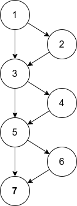
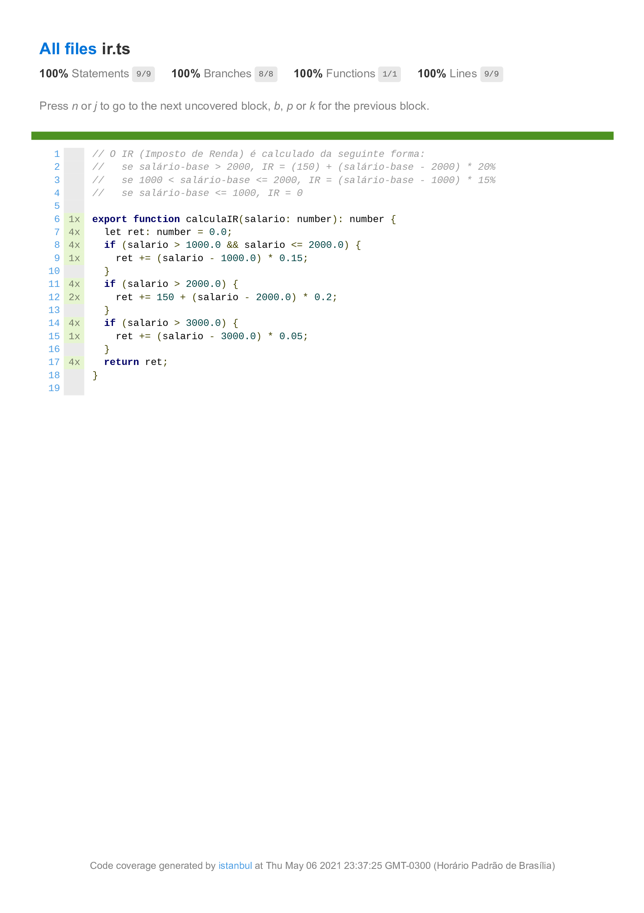

## Third exercise - IR coverage test

In this exercise I tested the IR calculation program implemented provided by our teacher and visible in the [`ir.ts`](src/ir.ts) file.

The main activity of this exercise was the coverage tests, so to do it I created a control flow chart based on the function provided. We can see this control flow graph below:

In the [`ir.test.ts`](src/ir.test.ts) file I created four tests to cover that control flow, and running the configured jest test script using the coverage flag we can find a implementation error and the full coverage of branchs and statements (files: [`index.html`](coverage/lcov-report/index.html) and [`ir.ts.html`](coverage/lcov-report/ir.ts.html)).

The `package.json` file has the `test` script, so we can run all `.test.ts` files using `npm test`.

The `index.html` output file:

The `ir.ts.html` output file:

