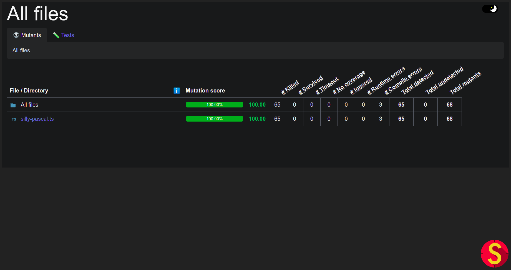
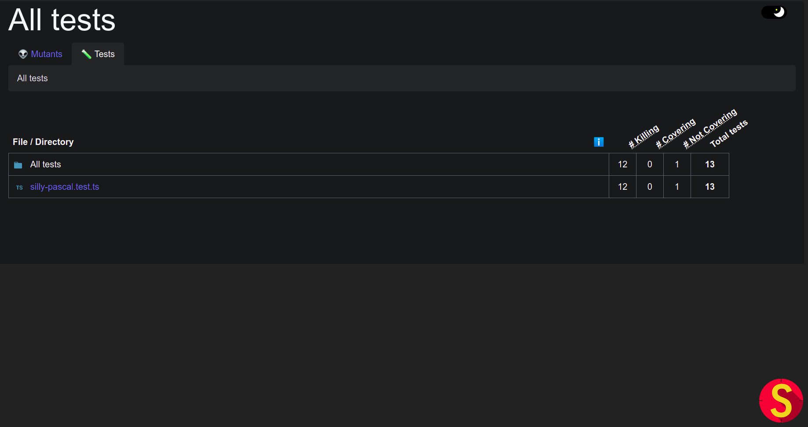
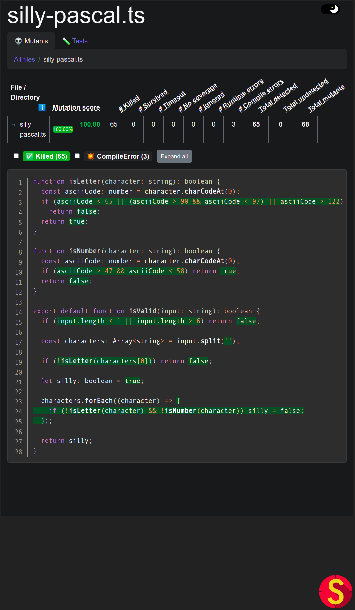
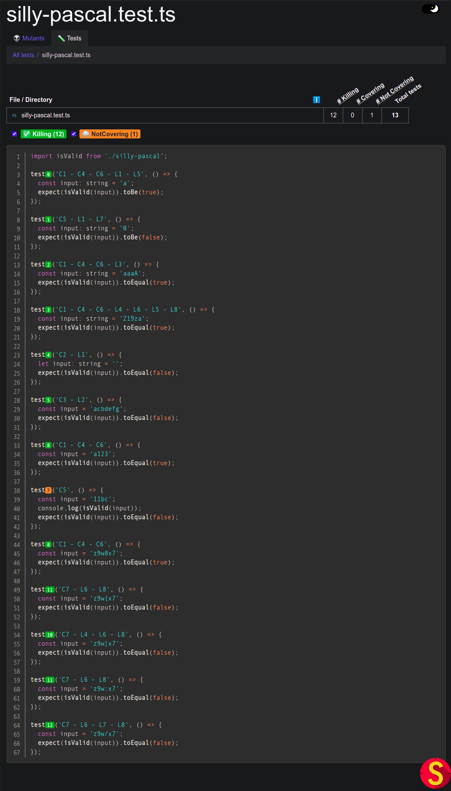

## Fourth exercise - Mutation test: Silly Pascal

In this exercise, I used a Silly Pascal verifier implemented in exercise of the course [silly-pascal](../silly-pascal/README.md). This function checks if the input string is a valid silly pascal.

The implemented function is inside the [silly-pascal.ts](src/silly-pascal.ts) file.

That is the equivalence class table:

| Input variable |                Valid equivalence class                 |            Invalid equivalence class             |
| :------------: | :----------------------------------------------------: | :----------------------------------------------: |
|     length     |            (L1) 1 <= length <= 6 (L2) (C1)             |         length < 1 (C2) length > 6 (C3)          |
|    input[0]    |        (L3, L4, L5, L6) isLetter(input[0]) (C4)        |             !isLetter(input[0]) (C5)             |
| i>0, input[i]  | isLetter(input[i]) && (L7, L8) isNumber(input[i]) (C6) | !(isLetter(input[i]) && isNumber(input[i])) (C7) |

In the previous table different than the other silly-pascal exercise I defined L classes to indicate the limits of each equivalence class and to use it in the tests. These limits were obtained considering the ASCII table in some cases.

The L classes limits:

- L1: Minimal length;
- L2: Maximal length;
- L3: Ascii code 65 (A);
- L4: Ascii code 90 (Z);
- L5: Ascii code 97 (a);
- L6: Ascii code 122 (z);
- L7: Ascii code 48 (0);
- L8: Ascii code 57 (9);

The main activity of this exercise is the mutation tests. To use it I have jest tests in the file [`silly-pascal.test.ts`](src/silly-pascal.test.ts). The mutator used here is the [`stryker`](https://stryker-mutator.io/) and it is configured in the `test` script of the project.

To run the configured jest and stryker scripts you can use `npm test`.

The `stryker` output can be found in the [`reports/mutation/html/index.html`](reports/mutation/html/index.html) file, but here I put some screenshots of it.

